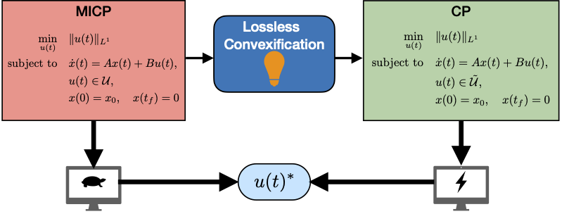

# MICP_LosslessConvexification

This project presents a Lossless Convexification in Fuel-Optimal Control of Linear Systems with Discrete Inputs.

Developed by: **Felipe Arenas-Uribe**  
Autonomy, Robotics and Controls Lab  
University of Kentucky  

<p align="center">
  
</p>

## Features

Computes a discrete-valued control by solving a Linear program, enabling implementation for real-time applications such as spacecraft rendezvous maneuvers.

---

## Usage

### Requirements

- Python 3.8+
- NumPy
- CvxPy
- Matplotlib

All dependencies can be installed via `pip`.

### Running the Examples

The examples and experiments from the [associated paper](https://arxiv.org/abs/2511.07711) are included.

---

## Citation

If you find this work useful, please consider citing:

**[Geometric Conditions for Lossless Convexification of Linear Systems with Discrete-Valued Inputs](https://arxiv.org/abs/2511.07711)**

```bash
@misc{arenasuribe2025geometricconditionslosslessconvexification,
      title={Geometric Conditions for Lossless Convexification in Fuel-Optimal Control of Linear Systems with Discrete-Valued Inputs}, 
      author={Felipe Arenas-Uribe and Hasan A. Poonawala and Jesse B. Hoagg},
      year={2025},
      eprint={2511.07711},
      archivePrefix={arXiv},
      primaryClass={math.OC},
      url={https://arxiv.org/abs/2511.07711}, 
}
```
